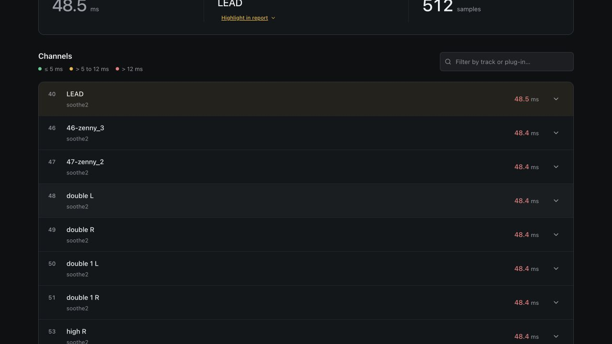
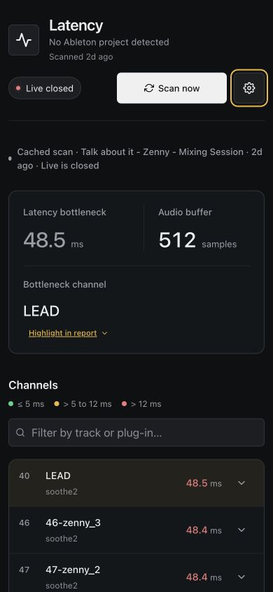

# Dashboard UI verification — 2026-09-26

Refinement preserves the existing dark studio palette and plain HTML/CSS/JS architecture. The summary separates latency, bottleneck channel, and buffer measurements. Channel rows now share one report surface; track numbers and measurement numerals align independently. Search sits beside the report title on desktop and spans the available width on mobile. Loading placeholders honor hidden state and no longer depend on transition events to disappear. The stylesheet is loaded normally instead of maintaining a second, divergent inline copy.

## Repeat the browser checks

1. Run `python3 app.py --no-open`, open the printed localhost URL, and dismiss the setup checklist for this session if needed. With an existing cached report, wait for it to load. Confirm the cache notice remains explicit and loading placeholders disappear. Actual inspected cache: 12 channels; bottleneck LEAD, 48.5 ms; buffer 512 samples.
2. Filter by a channel name (LEAD in the inspected cache). Wait for the 200 ms debounce. Confirm one matching row. Expand its details and check names, formats, activity, and latency remain readable. Do not click device names unless Live is running and device selection is intended.
3. Filter by `no-matching-channel-qa`. Confirm the no-matches message. Click Highlight in report; confirm the filter clears, all 12 rows return, and the bottleneck receives visible focus/highlight.
4. Open Settings; confirm Maintenance and Reset checklist are visible. Press Escape; confirm the dialog closes and focus returns to Settings. No preferences were reset during verification.
5. Repeat at 390 × 844 and 768 × 900, then restore the desktop viewport. Confirm no horizontal scrolling, accessible search input, and a stacked summary on mobile. Save desktop and mobile screenshots.

## Observed results

All checks above passed in the Codex in-app browser. Mobile document width matched viewport width at 390px and 768px. Visible skeleton count was zero after data loaded. No browser console errors were captured. Desktop (1280 × 720) and mobile (390 × 844) screenshots are adjacent to this file.

`node --check static/app.js`, `node scripts/test_workflow_severity.js`, and `git diff --check` passed. No new unit tests were added.

The Impeccable detector ran once in degraded regex mode because its optional HTML/CSS parser dependencies are unavailable. Two pre-existing accent-border warnings are in hidden, out-of-scope recommendation/comparison UI. Its unused bounce token warning was resolved by deleting the unused token. Detector output is not treated as a computed contrast audit.

## Limits

Ableton Live was closed. Verification used the real cached report, loading/offline status, and local UI interactions; fresh OSC scanning and device selection were not verified. The >50-row virtualized path was not exercised with this cache; its gap constant was updated to match the contiguous row layout. Reduced-motion behavior was reviewed in code, not OS-emulated. No frontend dependencies or backend behavior were added.

